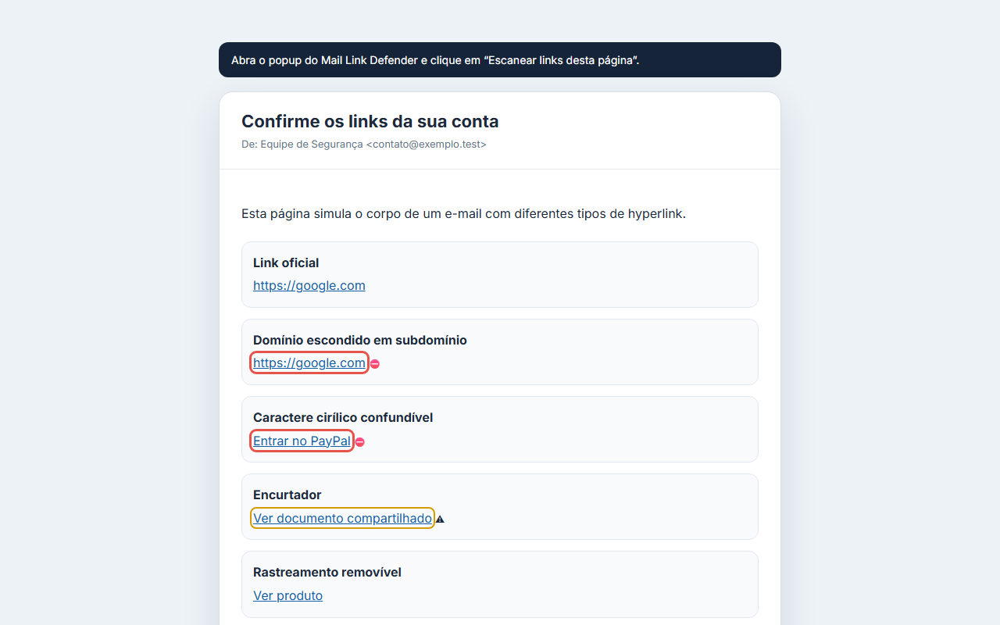

<p align="center">
  
</p>

# Mail Link Defender


Extensão defensiva para Chrome que analisa links em webmails e alerta sobre sinais de falsificação antes do clique.

> Projeto em estágio MVP. A extensão identifica indícios explicáveis; ela não garante que um link seja seguro ou fraudulento.

## Perigo visível antes do clique


## Demonstração



## O que já funciona

- proteção automática opcional no Gmail;
- scanner manual para qualquer página autorizada pelo clique no ícone;
- confirmação antes de abrir links de alta suspeita;
- comparação entre o endereço mostrado no e-mail e o destino real;
- identificação correta do domínio registrável usando a Public Suffix List;
- detecção de Punycode, mistura de alfabetos e caracteres Unicode confundíveis;
- comparação local com marcas frequentemente imitadas;
- detecção de credenciais na URL, IP, HTTP, portas incomuns, encurtadores e redirecionamentos;
- remoção conservadora de parâmetros de rastreamento;
- menu de contexto para analisar um link individual;
- processamento local, sem backend, telemetria ou histórico.

## Instalação para desenvolvimento

Requisitos: Node.js 24 ou versão compatível com as dependências atuais.

```bash
npm install
npm test
npm run build
```

Depois:

1. Abra `chrome://extensions`.
2. Ative o **Modo do desenvolvedor**.
3. Clique em **Carregar sem compactação**.
4. Selecione a pasta `dist`.
5. Abra o Gmail e clique no ícone da extensão.
6. Ative a proteção automática no cartão do Gmail.

## Comandos

```bash
npm test          # testes do analisador
npm run typecheck # validação TypeScript
npm run build     # gera a extensão em dist/
npm run dev       # build em modo watch
npm run demo      # página local com links de demonstração
```

Depois de executar `npm run demo`, abra `http://127.0.0.1:5173/demo/` e use o scanner manual da extensão.

## Como a classificação funciona

- **Nenhum indício relevante:** nenhuma regra local foi acionada. Não significa “seguro”.
- **Atenção recomendada:** há características que merecem inspeção.
- **Alta suspeita:** há uma evidência forte, como destino diferente do texto exibido ou imitação Unicode de uma marca.

As regras são determinísticas e cada resultado mostra seus motivos. Não existe pontuação opaca nem uso de IA.

## Privacidade

A extensão lê apenas os links das páginas em que foi autorizada a funcionar. URLs e conteúdo de e-mail não são enviados, armazenados ou usados para analytics. Veja [PRIVACY.md](PRIVACY.md).

## Estado do roadmap

- [x] núcleo de análise de URLs;
- [x] detecção Unicode e marcas confundíveis;
- [x] proteção automática no Gmail;
- [x] scanner manual e menu de contexto;
- [x] confirmação antes do clique;
- [x] testes manuais no Gmail real;
- [x] ícones e identidade visual para publicação;
- [ ] adaptador do Outlook;
- [ ] verificação opcional de redirecionamentos;
- [ ] publicação na Chrome Web Store.

## Licença

MIT. Consulte [LICENSE](LICENSE).

Contribuições são bem-vindas. Veja [CONTRIBUTING.md](CONTRIBUTING.md).
