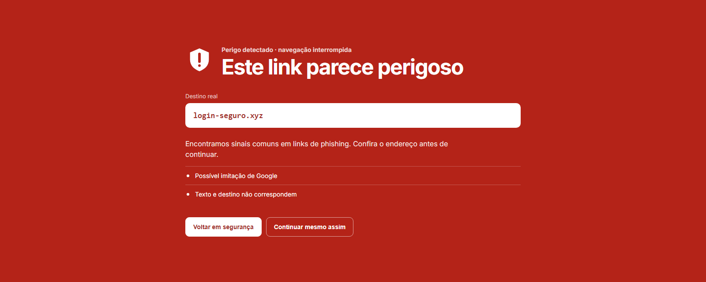
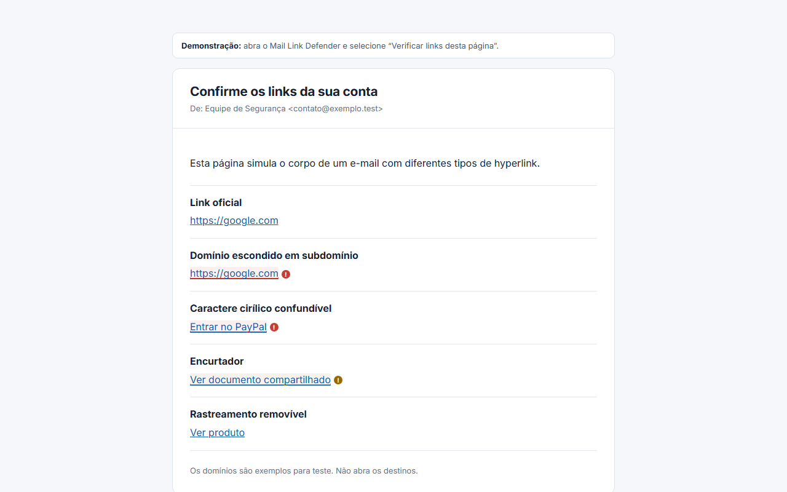
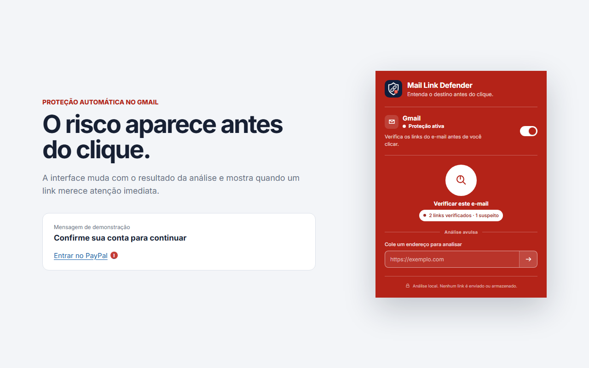
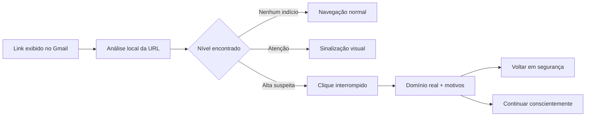

<p align="center">
  
</p>

<h1 align="center">Mail Link Defender</h1>

<p align="center">
  <strong>Links de phishing ficam convincentes. O destino real não.</strong><br />
  Extensão para Chrome que protege cliques no Gmail com análise local, alertas explicáveis e uma interrupção visual impossível de ignorar.
</p>

<p align="center">
  
  
  
  
  <a href="https://github.com/johnnymeunome/mail-link-defender/releases/latest"></a>
  
</p>

<p align="center">
  <a href="https://github.com/johnnymeunome/mail-link-defender/releases/latest"><strong>Baixar extensão</strong></a>
  ·
  <a href="#como-funciona">Como funciona</a>
  ·
  <a href="PRIVACY.md">Privacidade</a>
</p>



## O problema

Um link pode parecer `paypal.com` ou `google.com` e ainda levar para outro endereço. Golpes exploram caracteres Unicode visualmente semelhantes, subdomínios enganosos, encurtadores e diferenças entre o texto exibido e o destino real.

O Mail Link Defender foi criado para transformar esses detalhes técnicos em uma decisão simples **antes do clique**. Quando encontra evidências fortes, a extensão interrompe a navegação, revela o domínio real e explica cada motivo do alerta.

> O projeto identifica sinais de risco; ele não promete determinar sozinho se um site é seguro ou fraudulento.

## Experiência do produto

| Proteção dentro do Gmail | Feedback imediato no popup |
| --- | --- |
| Links são analisados e sinalizados diretamente na mensagem. | A interface muda de estado conforme o resultado: verde, amarelo ou vermelho. |
|  |  |

A tela de perigo usa o vermelho em toda a área disponível de propósito: a mudança de contexto comunica que o clique foi interrompido e reduz a chance de uma decisão automática.

## Como funciona



O analisador aplica regras determinísticas. Não há pontuação secreta nem classificação por IA: toda indicação apresentada na interface possui um motivo verificável.

### Sinais analisados

- caracteres Unicode confundíveis e mistura de sistemas de escrita;
- domínios Punycode e imitações de marcas conhecidas;
- divergência entre o texto visível e o endereço de destino;
- credenciais escondidas na URL, endereços IP e portas incomuns;
- conexões sem HTTPS, encurtadores e redirecionamentos externos;
- subdomínios excessivamente profundos;
- parâmetros de rastreamento que podem ser removidos com segurança.

## Diferenciais e decisões de engenharia

- **Privacidade por arquitetura:** a análise acontece no navegador, sem backend, analytics ou histórico de links.
- **Explicável por padrão:** o usuário vê o domínio registrado e as regras acionadas.
- **Foco no Gmail:** integração automática com o fluxo em que o risco realmente aparece, mantendo análise avulsa para outros casos.
- **Bloqueio conservador:** somente evidências fortes interrompem o clique; sinais fracos aparecem como atenção para reduzir falsos positivos.
- **Permissões limitadas:** acesso automático apenas a `mail.google.com`; outras páginas exigem uma ação explícita do usuário.
- **Interface orientada a estado:** cores, texto e movimento comunicam análise, segurança, atenção e perigo sem depender apenas de ícones.

## O que este projeto demonstra

- desenvolvimento de uma extensão Chrome com Manifest V3;
- TypeScript em modo estrito e módulos separados para popup, background e content script;
- manipulação segura do DOM em uma aplicação de terceiros;
- normalização de URLs, Public Suffix List, Punycode e análise de Unicode;
- design de produto para segurança, acessibilidade e prevenção de decisões impulsivas;
- documentação de privacidade, permissões e materiais para distribuição.

## Qualidade

- **42 testes automatizados** cobrindo o núcleo do analisador;
- validação estática com TypeScript strict;
- build de produção separado para popup, service worker e content script;
- zero vulnerabilidades conhecidas na última auditoria de dependências;
- testes manuais realizados no Gmail e em uma caixa de entrada de demonstração.

## Instalar e experimentar

Como a extensão ainda não está publicada na Chrome Web Store, a instalação atual utiliza o modo de desenvolvedor:

1. Baixe o ZIP da [Release mais recente](https://github.com/johnnymeunome/mail-link-defender/releases/latest).
2. Extraia o conteúdo para uma pasta permanente.
3. Abra `chrome://extensions` no Chrome.
4. Ative o **Modo do desenvolvedor**.
5. Clique em **Carregar sem compactação** e selecione a pasta extraída.
6. Abra o Gmail; a proteção automática pode ser controlada pelo popup da extensão.

Para avaliar o projeto sem usar e-mails reais, execute a caixa de entrada de demonstração descrita abaixo.

## Desenvolvimento local

Requisitos: Node.js 24 ou versão compatível com as dependências atuais.

```bash
npm install
npm test
npm run typecheck
npm run build
```

Carregue a pasta `dist` em `chrome://extensions` usando **Carregar sem compactação**.

```bash
npm run dev   # recompila a extensão ao alterar o código
npm run demo  # inicia a caixa de entrada de demonstração
```

Depois de `npm run demo`, abra `http://127.0.0.1:5173/demo/` e use o scanner manual da extensão.

## Estrutura principal

```text
src/
├── analyzer/     # normalização, domínio, Unicode e regras de risco
├── background/   # menu de contexto e coordenação da extensão
├── content/      # integração, marcação e proteção de cliques no Gmail
└── popup/        # controles, análise avulsa e feedback visual
tests/            # testes automatizados do analisador
demo/             # caixa de entrada e cenários seguros de demonstração
portfolio/        # screenshots e materiais de apresentação
```

## Roadmap

- [x] analisador local e explicável de URLs;
- [x] detecção Unicode, Punycode e marcas confundíveis;
- [x] proteção automática e confirmação antes do clique no Gmail;
- [x] scanner manual e menu de contexto;
- [x] tratamento de falsos positivos comuns;
- [x] identidade visual, screenshots e Release instalável;
- [ ] adaptador para Outlook Web;
- [ ] verificação opcional da cadeia de redirecionamentos;
- [ ] publicação na Chrome Web Store.

## Privacidade e contribuição

URLs e conteúdo de e-mail não são enviados a servidores. Consulte a [política de privacidade](PRIVACY.md), a [especificação técnica](docs/SPECIFICATION.md) e o [guia de contribuição](CONTRIBUTING.md).

Distribuído sob a licença [MIT](LICENSE).
